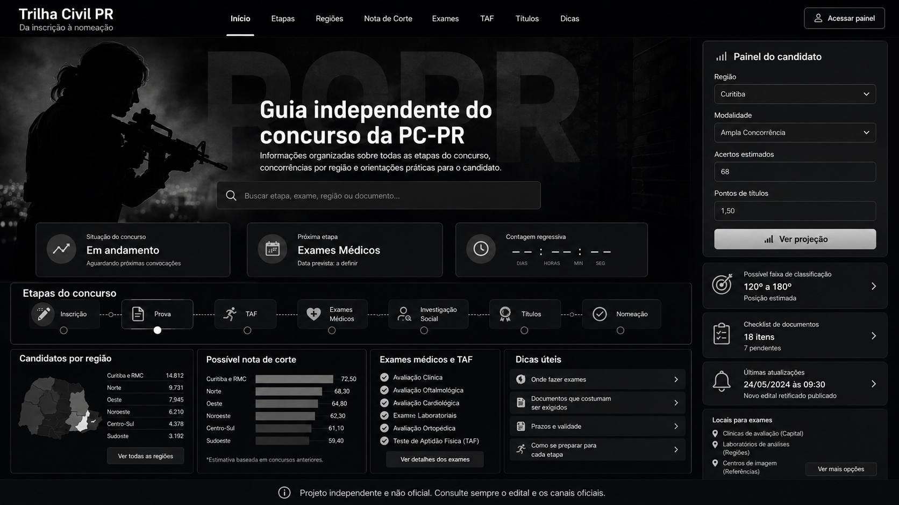

# Edital no Controle

Status: versão 0.2.0 publicada/preparada para evolução com dados oficiais do edital.

Portal independente e não oficial para organizar informações sobre o concurso da Polícia Civil do Paraná. O projeto não substitui edital, banca organizadora, retificações ou canais oficiais.

## Visão geral

O Edital no Controle reúne etapas, regiões, nota mínima e cláusulas de barreira, exames, TAF, títulos, dicas práticas, locais fictícios para exames e metodologia de fontes. O MVP não possui backend, autenticação, cadastro, upload, pagamentos nem coleta de dados pessoais.

## Captura principal



A homepage mantém título, descrição e aviso como elementos HTML reais; a arte completa não é usada como fundo da página.

## Funcionalidades atuais

- Homepage responsiva com hero, busca local, linha do tempo e cards informativos.
- Menu desktop e menu móvel acessível.
- Painel do candidato local com mínimo oficial, barreiras por região/modalidade e posição estimada não oficial.
- Dados oficiais do Edital nº 01/2026 separados em `src/data/edital.ts`.
- Página `/edital` com identificação, itens usados, data de conferência e link para a FGV.
- TAF com seletor por sexo biológico e faixa etária.
- Calculadora local de títulos com limites oficiais e total máximo de 15,5 pontos.
- Badges para dado oficial, estimativa e demonstração.
- Política de privacidade, termos, 404, sitemap e robots.

## Tecnologias

Next.js App Router, TypeScript, Tailwind CSS, Lucide React, Recharts, ESLint, npm e Git.

## Rotas

`/`, `/edital`, `/etapas`, `/regioes`, `/nota-de-corte`, `/exames`, `/taf`, `/titulos`, `/dicas`, `/fontes`, `/atualizacoes`, `/privacidade`, `/termos`, `/sobre`.

## Estrutura de diretórios

```text
src/app        rotas, layout, sitemap, robots e 404
src/components componentes reutilizáveis
src/data       dados oficiais, estimativas, demonstrações e fontes
src/types      tipos TypeScript
src/lib        configuração e formatadores
public         imagens, referência visual e favicon
docs           documentação acadêmica e publicação
```

## Instalação e comandos

```bash
npm install
npm run dev
npm run lint
npm run build
npm run start
npm audit
```

## Transparência dos dados

- `oficial`: informação vinculada ao edital oficial cadastrado localmente e à página oficial da FGV.
- `estimativa`: projeção local sem valor oficial.
- `demonstracao`: conteúdo fictício usado para validar interface, fluxo e documentação.

O edital local está em `docs/fontes-oficiais/edital-pcpr-01-2026.pdf`, mas o PDF não é disponibilizado publicamente pelo portal. Não são usadas URLs oficiais inventadas.

## Limitações

- A posição estimada do painel não é oficial.
- O portal não declara aprovação, convocação ou classificação.
- Locais para exames são exemplos fictícios.
- Retificações futuras precisam de conferência manual.
- Não há banco de dados, autenticação, analytics ou coleta de dados pessoais.

## Aviso não oficial

Projeto independente e não oficial. Consulte sempre o edital e os canais oficiais.

## Privacidade e termos

A política está em `/privacidade` e explica que o MVP não coleta dados pessoais. Os termos estão em `/termos` e reforçam a prevalência do edital e a ausência de garantias.

## Deploy resumido

Execute `npm run lint`, `npm run build` e `npm audit`; configure `NEXT_PUBLIC_SITE_URL` como `https://editalnocontrole.com.br`; publique em provedor compatível com Next.js, como Vercel; teste homepage, rotas internas, 404, sitemap, robots, menu móvel, busca e painel local.

## Documentação acadêmica

Consulte `docs/projeto-academico.md`, `docs/requisitos.md`, `docs/arquitetura.md`, `docs/fontes.md`, `docs/testes.md`, `docs/roadmap.md`, `docs/deploy.md` e `docs/checklist-publicacao.md`.

## Roadmap

Monitorar retificações oficiais, ampliar testes automatizados, revisar metodologia de estimativas e evoluir recursos sem coleta de dados pessoais sem nova política.